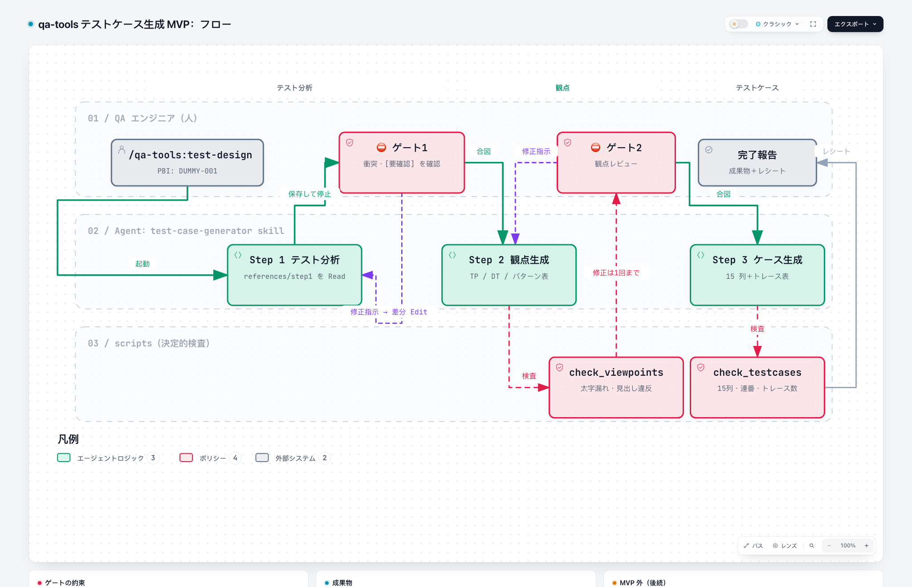

# qa-tools

QA エンジニア向けの AI テスト設計ツール集（Claude Code プラグイン）。

現在の中身は 2 つの skill である。

- **test-case-generator**：PBI の資料から、サイジング → テスト分析 → テスト観点 → 15 列のテストケース → セルフレビューを、QA のレビューゲートで止まりながら段階的に作る
- **test-priority**：テストケース 1 件ずつに、回帰テストとしての重要度（R1〜R4）と、実行する規模（sanity / smoke / light / full）を決める。AI は意味の判断だけをして、重要度と規模は設定の規則からスクリプトが計算する



- 構成要素の図：[docs/architecture/components.png](docs/architecture/components.png)
- 図の元データは同じフォルダの `*.json`。[archify](https://github.com/tt-a1i/archify) で操作できる HTML を生成できる（手順は CLAUDE.md）

## 試す（ダミー製品）

`examples/dummy-product/` は架空の製品「DUMMY ToDo Cloud」の利用側プロジェクトである。すべてテスト用のダミー情報で、実在の製品・仕様ではない。

プラグインとして読み込んだディレクトリの中には書き込めないので、ダミー製品は**プラグインの外にコピーしてから**使う。

```bash
cp -R examples/dummy-product /tmp/dummy-product
cd /tmp/dummy-product
claude --plugin-dir <このリポジトリの絶対パス>
```

Claude Code の中で次を実行する（プラグインの skill は `プラグイン名:skill 名` で呼ぶ）。

```
/qa-tools:test-case-generator PBI: DUMMY-001
```

1. サイジングとテスト分析を `output/DUMMY-001/` に保存して、**分析レビュー** で止まる。QA 算出サイズ、衝突アラート、`[要確認]` を確認する
2. `観点設計に進んでください` と入力 → 観点を作り、検査してから **観点レビュー** で止まる
3. `ケース生成に進んでください` と入力 → テストケースを作り、セルフレビュー（検査と目視、修正は 1 回まで）をして結果を報告する

途中からやり直すときは `/qa-tools:test-case-generator PBI: DUMMY-001 from: viewpoints` のように指定する。コマンドを使わず「DUMMY-001 のテストケースを作って」と頼んでも skill が起動する。

## test-priority を試す（ダミー製品）

test-case-generator の出力（`output/DUMMY-001/4-testcases.md`）を入力にする。出力例が `examples/dummy-product/sample-output/DUMMY-001/` にあるので、それを `output/` にコピーして使う。

```bash
cp -R examples/dummy-product /tmp/dummy-product
cd /tmp/dummy-product
mkdir -p output && cp -R sample-output/DUMMY-001 output/DUMMY-001
claude --plugin-dir <このリポジトリの絶対パス>
```

Claude Code の中で `/qa-tools:test-priority build` を実行する。設定は `.qa/test-priority.toml`（自分のプロジェクトでは `/qa-tools:test-priority init` で質問に答えて作る）。

`output/test-priority/` に、取り込み用の `import.csv`、レビュー用の `review.csv`（理由と要レビューの印つき）、`manifest.json` ができる。出力例は `examples/dummy-product/sample-output/test-priority/`、仕様は [docs/design/tools/test-priority.md](docs/design/tools/test-priority.md) にある。

## 自分のプロジェクトで使う

1. 手元の clone からプラグインを入れる（一度だけ。どこにも公開されない）

   ```bash
   claude plugin marketplace add <この clone の絶対パス>
   claude plugin install qa-tools@qa-tools
   ```

   手元の clone を直接読むので、qa-tools を編集すると次のセッションから反映される（更新コマンドは不要）。チェックアウト中のブランチの内容が使われる

2. プロジェクトのルートに `.qa/product.md` を作る（書式は [examples/dummy-product/.qa/product.md](examples/dummy-product/.qa/product.md) を参照）。最低限、チケット接頭辞・領域コード・ロール表を書く
3. 必要なら `.qa/knowledge/` に既存機能のナレッジを置く
4. `PBI/{ID}/` に仕様書と受入基準を置き、`/qa-tools:test-case-generator PBI: {ID}` を実行する

## 構成

```
.claude-plugin/          プラグイン・マーケットプレイスのマニフェスト
skills/test-case-generator/
  SKILL.md               司令塔：入力の契約、フロー、ゲート、検証
  references/            各 Step の手順。その Step に入ったときだけ読む
  assets/                成果物の雛形（出力形式の正）
  scripts/               決定的な検査（標準ライブラリのみ、JSON レシート）
  evals/evals.json       挙動評価のケース（skill-creator の形式）
skills/test-priority/    同じ構成。platforms/ にテストケースの形式ごとの読み方を置く
core/                    2 つ以上のツールが使う共通処理（manifest.json の読み書き）
examples/dummy-product/  テスト用ダミー製品
docs/design/             設計の正本（用語集・原則・共通の約束ごと・ツール同士の受け渡し）
docs/architecture/       アーキテクチャ図（archify）
tests/                   検査スクリプトと skill 構造のテスト
```

設計の考え方は次の 4 点である。今後追加するツール（code-map・screen-list）も含めた原則と約束ごとは、[docs/design/](docs/design/principles.md) にまとめてある。

- **汎用のプロセスと製品コンテキストを分ける。** skill は製品を知らない。製品固有の値は利用側の `.qa/` に置く
- **Step ごとに必要なものだけを読む。** SKILL.md は流れとゲートだけを持ち、各 Step の詳細は references に分ける。references の冒頭は「契約（入力・出力・検査・次）」で揃えてあり、将来 Step を独立した skill に昇格できる
- **機械で確かめられることはスクリプトで確かめる。** 太字漏れ、見出し違反、15 列、ケース ID の連番、観点 → ケースの数え直しを検査する
- **人のゲートで止まる。** AI は QA の合図なしに次の Step へ進まない

## 開発

```bash
python3 -m unittest discover -s tests -t .
claude plugin validate .
```

## まだ実装していないもの

元の設計にある次の要素は、まだ実装していない：USM 関連性分析（元の Step U）、ナレッジの選別と承認（元の Step K / K-Gate / K-Evidence）、PBI ナレッジ DB 連携、E2E・シナリオ・ドメイン特化などのモード、英語出力。
