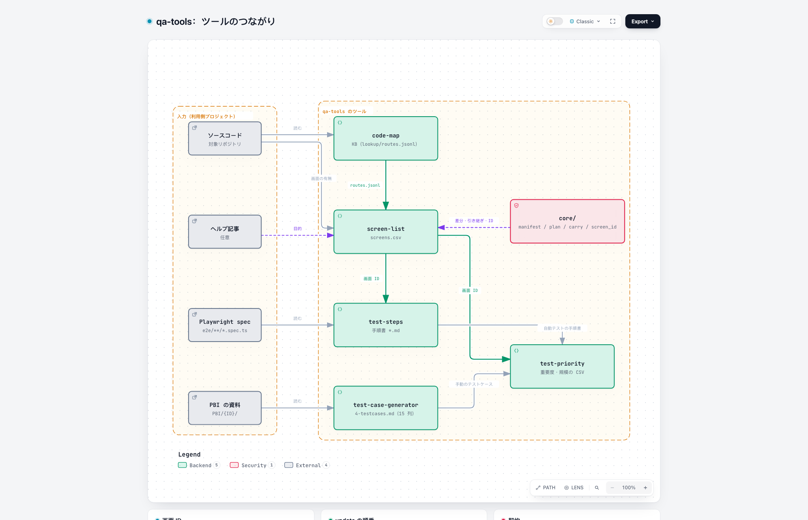

# ツール同士の受け渡し

どのツールが、他のどのツールの出力を読むかを決める。ここに書いていない読み方はしない（[principles.md](principles.md) の P8）。言葉の定義は [glossary.md](glossary.md) にある。

- **状態**：表に出てくるツールのうち、実装済みは test-case-generator だけ
- **変えるとき**：表を変える PR を先に出し、マージしてから読む側を実装する

## 公開ファイルの一覧

他のツールが読んでよいのは、この表のファイル（と列）だけである。

| ID | 読むツール | 作るツール | 公開ファイル | 読んで何をするか |
| --- | --- | --- | --- | --- |
| F1 | screen-list | code-map | `output/code-map/lookup/tree.md` | ファイルのモジュールを引いて `モジュール` 列に書く。`ハッシュ` 列と今のファイルの内容を比べて、code-map が古くないかを、ファイルごとに確かめる（git に頼らない） |
| F2 | screen-list | code-map | `output/code-map/manifest.json` | `source`（git のコミット、または内容のハッシュ）を、自分の manifest の `source` と `inputs` に写す |
| F3 | test-priority | test-case-generator | `output/*/4-testcases.md` の 15 列の表 | 判定するテストケースの一覧として読む（プラットフォーム定義 `tcg-markdown`） |
| F4 | test-priority | screen-list | `output/screen-list/screens.csv` の `画面ID` 列と `画面名` 列 | テストケースの「確認画面」列の画面名から画面 ID を引く |
| F5 | screen-list | code-map | `output/code-map/lookup/reverse_imports.jsonl` | ダイアログのファイルから import を上へ辿り、開く画面（`親画面ID`）を求める |

**画面の候補は screen-list が自分で列挙する（決定）**：何が画面かは UI フレームワークによって違うので、screen-list のプラットフォーム定義（[contracts.md の C9](contracts.md#c9-プラットフォーム定義)）が列挙する。code-map は言語の単位（import・シンボル・モジュール）だけを扱い、画面を知らない。

**読み合わないこと（決定）**：code-map は screen-list の出力を読まない。読み合うと、どちらを先に `update` しても、片方が 1 つ前の版を読むことになるからである。

## 画面 ID

| 決めたこと | 内容 |
| --- | --- |
| 作るのは | screen-list だけ。他のツールは screens.csv から引くだけで、自分で作らない |
| 形 | 画面は `<接頭辞>/<画面のキー>`、ダイアログは `<接頭辞>#<キー>`。接頭辞とキーの作り方は、screen-list のプラットフォーム定義が決める（[仕様](tools/screen-list.md)の 4.2） |
| 例 | Next.js App Router：接頭辞 `web`、キーは URL のパス（`/settings` → `web/settings`）。Android なら接頭辞 `android`、キーは Activity のクラス名、のように決める |
| 変わらないこと | 画面名を変えても ID は変わらない。画面のキー（URL のパスなど）を変えたときだけ変わる |
| 引けないとき | 他のツールで画面 ID を決められないときは `[未解決: 画面を特定できない]` と書く（P5） |

画面 ID でつなぐと、次の 3 つの問いに答えられる。

1. この画面は、どのモジュールで実装されているか（screens.csv の `モジュール` 列。F1）
2. この画面を確かめているテストケースはあるか（F4）
3. どのテストケースにも出てこない画面はどれか（#27 で作る）

## update を実行する順番

ソースコードが変わったら、次の順に `update` を実行する。後のツールが、前のツールの新しい出力を読めるようにするためである。

1. `/qa-tools:code-map update`
2. `/qa-tools:screen-list update`
3. `/qa-tools:test-priority update`

各ツールは `update` を始める前に、自分の manifest の `inputs` と、読む先のツールの今の manifest の `source` を比べる。違っていたら（＝読む先が更新されていたら）、そのことを人に伝えてから進める。

## 役割の分担

「今回の変更で、どのテストまで実行するか」（変更されたファイル → 画面 → テスト）は、code-map と screen-list の出力で絞り込む。テストケースごとに重要度と規模を決める test-priority には、この絞り込みを入れない。
